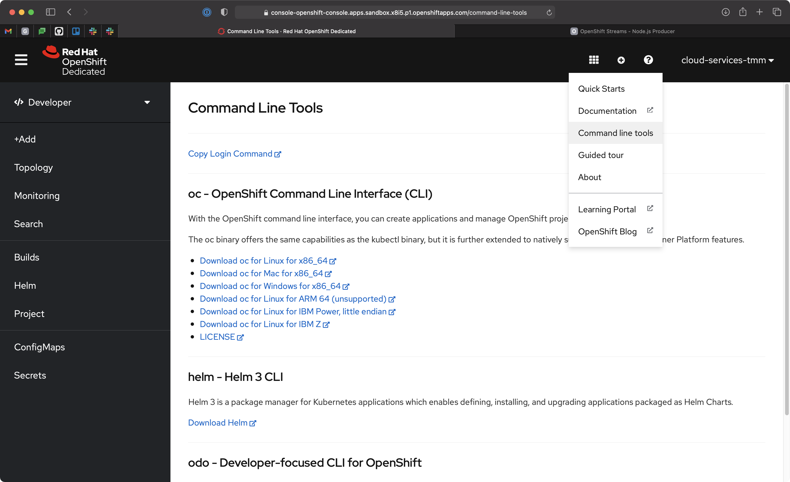

# OpenShift Streams Node.js Service Binding Example

A Node.js application that integrates with a Kafka instance hosted on Red Hat
OpenShift Streams for Apache Kafka.

The connection credentials and configuration for the Kafka instance are
injected into the application using
[Service Binding](https://github.com/k8s-service-bindings/spec). Specifically,
the [kube-service-bindings](https://github.com/nodeshift/kube-service-bindings)
Node.js module is used to read the bindings.

<div align="center">
	<br>
    
	<br>
  <i>A high-level summary of Service Binding with Red Hat OpenShift Streams for Apache Kafka.</i>
  <br>
  <br>
</div>

## Requirements

* Red Hat Cloud Account (Sign-up on the [cloud.redhat.com](https://cloud.redhat.com) Log-in page)
* OpenShift >= v4 (use [OpenShift Developer Sandbox](https://developers.redhat.com/developer-sandbox) for free!)
* Node.js >= v12
* [OpenShift CLI](https://mirror.openshift.com/pub/openshift-v4/clients/ocp/stable/)
* [Red Hat OpenShift Application Services Operator](https://github.com/redhat-developer/app-services-operator) (pre-installed on [OpenShift Developer Sandbox](https://developers.redhat.com/developer-sandbox))
* [Red Hat OpenShift Application Services CLI](https://github.com/redhat-developer/app-services-cli)

## Deployment

Typically, the Service Binding will be managed by the
[RHOAS Operator](https://github.com/redhat-developer/app-services-operator)
in your OpenShift or Kubernetes cluster. However, for local development
the bindings are managed using the *.bindingroot/* directory.

Take a look at the difference between the `start` and `dev` scripts in the
*package.json* file. Notice how the `dev` script references the local bindings,
directory but the regular `start` script doesn't? This is because the RHOAS
Operator manages the `SERVICE_BINDING_ROOT` when deployed on OpenShift or
Kubernetes.

### Create and Prepare a Managed Kafka

You must create a Kafka on Red Hat OpenShift Streams for Apache Kafka prior to
using the Node.js application.

Use the RHOAS CLI to create and configure a managed Kafka instance:

```bash
# Login using the browser-based flow
rhoas login

# Create a kafka by following the prompts
rhoas kafka create my-kafka

# Select a Kafka instance to use for future commands
rhoas kafka use

# Create the topic used by the application
rhoas kafka topic create orders
```

### Deploy on OpenShift

Deploy the application on OpenShift.

You'll need to login using the OpenShift CLI first. Instructions to login via
the CLI are available in the *Command line tools* help from your cluster UI.



Once you've logged into the cluster using the OpenShift CLI deploy the
application:

```bash
# Choose the project to deploy into. Use the "oc projects"
# command to list available projects.
oc project $PROJECT_NAME_GOES_HERE

# Deploy the application on OpenShift using Nodeshift CLI
# This will take a minute since it has to build the application
npm install
npx nodeshift --useDeployment --expose
```

When deployed in production this application expects the bindings to be
supplied in the Kubernetes Deployment spec. Without these it will crash loop,
as indicated by a red ring.


Bindings can be configured using the
[RHOAS CLI](https://github.com/redhat-developer/app-services-cli):

```bash
# Login using the browser-based flow
rhoas login

# Link your OpenShift/Kubernetes project/namespace to the Kafka
rhoas cluster connect

# Bind your Kafka to a Deployment
rhoas cluster bind
```

The application will now start. Use the following command to get the
application URL!

```bash
oc get route producer -o jsonpath='{.spec.host}
```

Now you can submit an order via browser. The order is placed into the `orders` topic in your Kafka instance.


### Develop Locally

The *.bindingroot/kafka/* directory already contains some configuration files.
Think of the filename as a key, and file contents as a value. The SASL mechanism
and protocol are known ahead of time so they're checked into the repository.

A bootstrap server URL, and connection credentials are not checked-in though,
since they're unique to you and should be kept secret.

Create the following files in the *.bindingroot/kafka/* directory. Each should
contain a single line value described below:

* _bootstrapServers_: Obtain from the [OpenShift Streams UI](https://cloud.redhat.com/beta/application-services/streams/kafkas), or via `rhoas kafka describe`
* _user_ & _password_: Obtain via the Service Accounts section of the OpenShift Streams UI, or the `rhoas serviceaccounts create` command.

For example the *bootstrapServers* file should contain a URL such as
`sbo-exampl--example.bf2.kafka.rhcloud.com:443`.

The *user* is a value similar to `srvc-acct-a4998163-xxx-yyy-zzz-50149ce63e23`
and *password* has a format similar to `15edf9b3-7027-4038-b150-998f225d3baf`.

Once these values are defined, start the the application:

```
npm run dev
```

During development the information used to connect to Kafka is printed on
startup.

_NOTE: These are sensitive credentials. Do not share them. This image is provided as an example of output._


## Building an Image

This requires Docker/Podman and [Source-to-Image](https://github.com/openshift/source-to-image).

```bash
# Output image name
export IMAGE_NAME=quay.io/evanshortiss/rhosak-nodejs-sbo-example

# Base image used to create the build
export BUILDER_IMAGE=registry.access.redhat.com/ubi8/nodejs-14

# Don't pass these files/dirs to the build
export EXCLUDES="(^|/)\.git|.bindingroot|node_modules(/|$)"

# Build the local code into a container image
s2i build -c . --exclude $EXCLUDES $BUILDER_IMAGE $IMAGE_NAME
```
